# Life Calculator Visual Flowcharts

**Interactive Mermaid diagrams showing calculation flows and decision trees**

---

## 📑 Table of Contents

1. [Complete Calculation Flow](#complete-calculation-flow)
2. [Validation Flow](#validation-flow)
3. [Partial Surcharges Calculation](#partial-surcharges-calculation)
4. [lifeFactor Calculation](#lifefactor-calculation)
5. [Final Insurance Calculations](#final-insurance-calculations)
6. [BMI Lookup Logic](#bmi-lookup-logic)
7. [Blood Pressure Matrix Lookup](#blood-pressure-matrix-lookup)
8. [Special Value Handling](#special-value-handling)
9. [Service Architecture](#service-architecture)

---

## 🔄 Complete Calculation Flow

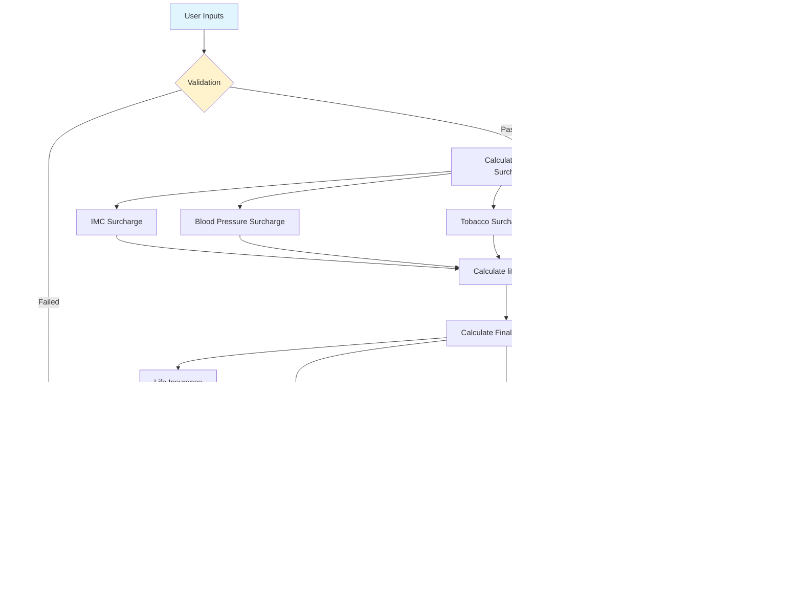
```mermaid
graph TD
    A[User Inputs] --> B{Validation}
    B -->|Failed| C[Show Error Modal]
    B -->|Passed| D[Calculate Partial Surcharges]
    
    D --> E[IMC Surcharge]
    D --> F[Blood Pressure Surcharge]
    D --> G[Tobacco Surcharge]
    D --> H[Alcohol Surcharge]
    D --> I[Cholesterol Surcharge]
    
    E --> J[Calculate lifeFactor]
    F --> J
    G --> J
    H --> J
    I --> J
    
    J --> K[Calculate Final Insurances]
    
    K --> L[Life Insurance]
    K --> M[Disability Insurance]
    K --> N[Accident Insurance]
    K --> O[Serious Illness Insurance]
    K --> P[ILT Insurance]
    
    L --> Q{Life > inMax?}
    Q -->|Yes| R[Reject All Insurances]
    Q -->|No| S[Return Results]
    
    M --> S
    N --> S
    O --> S
    P --> S
    
    C --> T[End]
    R --> T
    S --> T
    
    style A fill:#e1f5ff
    style B fill:#fff3cd
    style C fill:#f8d7da
    style S fill:#d4edda
    style R fill:#f8d7da
```

---

## ✅ Validation Flow

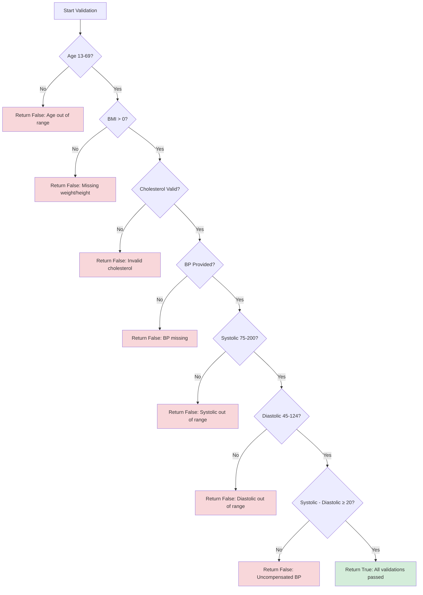
```mermaid
graph TD
    A[Start Validation] --> B{Age 13-69?}
    B -->|No| C[Return False: Age out of range]
    B -->|Yes| D{BMI > 0?}
    
    D -->|No| E[Return False: Missing weight/height]
    D -->|Yes| F{Cholesterol Valid?}
    
    F -->|No| G[Return False: Invalid cholesterol]
    F -->|Yes| H{BP Provided?}
    
    H -->|No| I[Return False: BP missing]
    H -->|Yes| J{Systolic 75-200?}
    
    J -->|No| K[Return False: Systolic out of range]
    J -->|Yes| L{Diastolic 45-124?}
    
    L -->|No| M[Return False: Diastolic out of range]
    L -->|Yes| N{Systolic - Diastolic ≥ 20?}
    
    N -->|No| O[Return False: Uncompensated BP]
    N -->|Yes| P[Return True: All validations passed]
    
    style C fill:#f8d7da
    style E fill:#f8d7da
    style G fill:#f8d7da
    style I fill:#f8d7da
    style K fill:#f8d7da
    style M fill:#f8d7da
    style O fill:#f8d7da
    style P fill:#d4edda
```

---

## 📊 Partial Surcharges Calculation

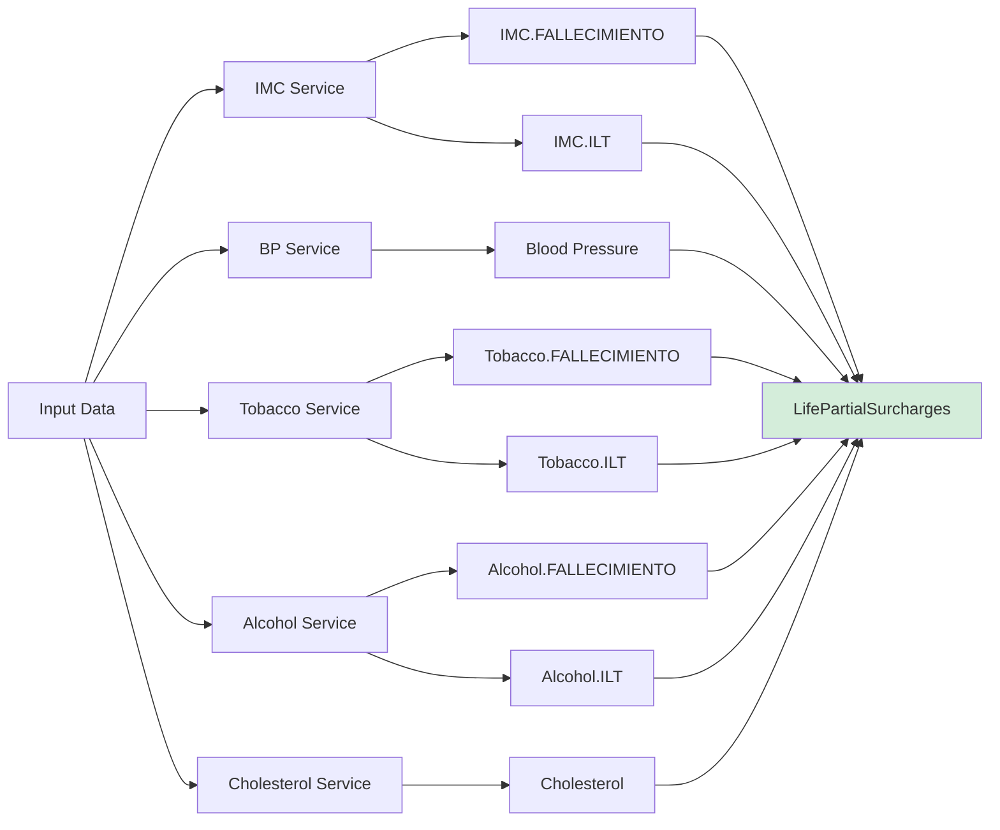
```mermaid
graph LR
    A[Input Data] --> B[IMC Service]
    A --> C[BP Service]
    A --> D[Tobacco Service]
    A --> E[Alcohol Service]
    A --> F[Cholesterol Service]
    
    B --> G[IMC.FALLECIMIENTO]
    B --> H[IMC.ILT]
    
    C --> I[Blood Pressure]
    
    D --> J[Tobacco.FALLECIMIENTO]
    D --> K[Tobacco.ILT]
    
    E --> L[Alcohol.FALLECIMIENTO]
    E --> M[Alcohol.ILT]
    
    F --> N[Cholesterol]
    
    G --> O[LifePartialSurcharges]
    H --> O
    I --> O
    J --> O
    K --> O
    L --> O
    M --> O
    N --> O
    
    style O fill:#d4edda
```

---

## 🎲 lifeFactor Calculation

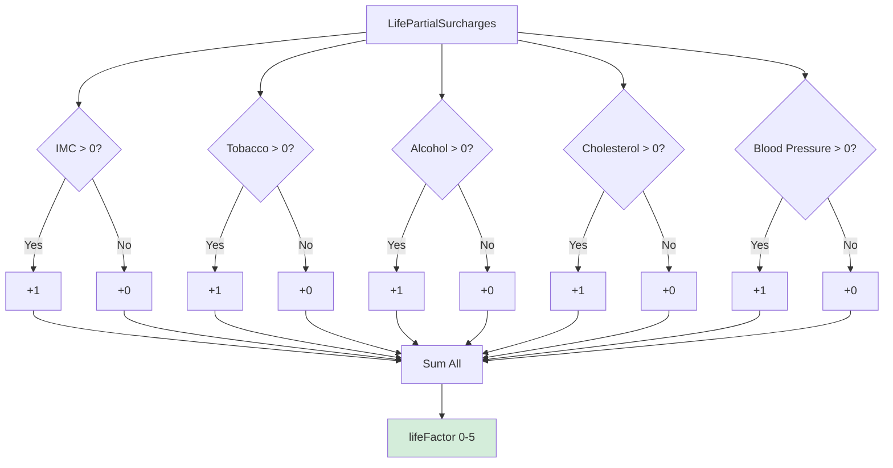
```mermaid
graph TD
    A[LifePartialSurcharges] --> B{IMC > 0?}
    B -->|Yes| C[+1]
    B -->|No| D[+0]
    
    A --> E{Tobacco > 0?}
    E -->|Yes| F[+1]
    E -->|No| G[+0]
    
    A --> H{Alcohol > 0?}
    H -->|Yes| I[+1]
    H -->|No| J[+0]
    
    A --> K{Cholesterol > 0?}
    K -->|Yes| L[+1]
    K -->|No| M[+0]
    
    A --> N{Blood Pressure > 0?}
    N -->|Yes| O[+1]
    N -->|No| P[+0]
    
    C --> Q[Sum All]
    D --> Q
    F --> Q
    G --> Q
    I --> Q
    J --> Q
    L --> Q
    M --> Q
    O --> Q
    P --> Q
    
    Q --> R[lifeFactor 0-5]
    
    style R fill:#d4edda
```

---

## 💰 Final Insurance Calculations

### Life Insurance
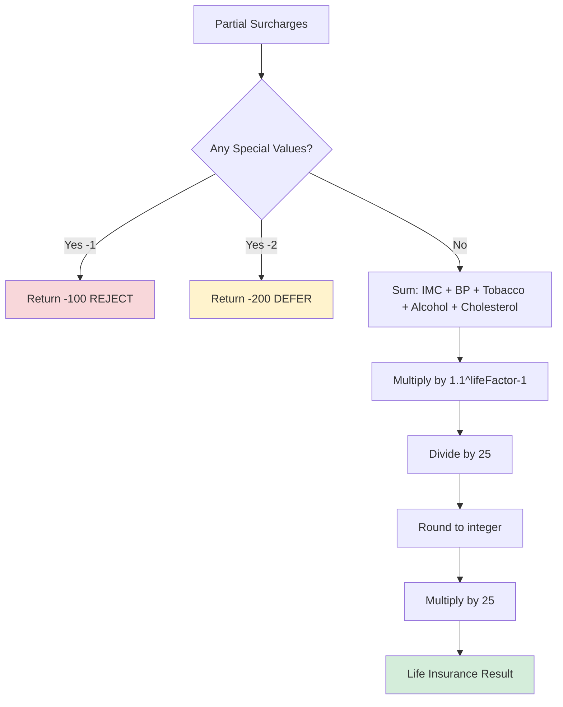
```mermaid
graph TD
    A[Partial Surcharges] --> B{Any Special Values?}
    B -->|Yes -1| C[Return -100 REJECT]
    B -->|Yes -2| D[Return -200 DEFER]
    B -->|No| E[Sum: IMC + BP + Tobacco + Alcohol + Cholesterol]
    
    E --> F[Multiply by 1.1^lifeFactor-1]
    F --> G[Divide by 25]
    G --> H[Round to integer]
    H --> I[Multiply by 25]
    I --> J[Life Insurance Result]
    
    style C fill:#f8d7da
    style D fill:#fff3cd
    style J fill:#d4edda
```

### Accident Insurance
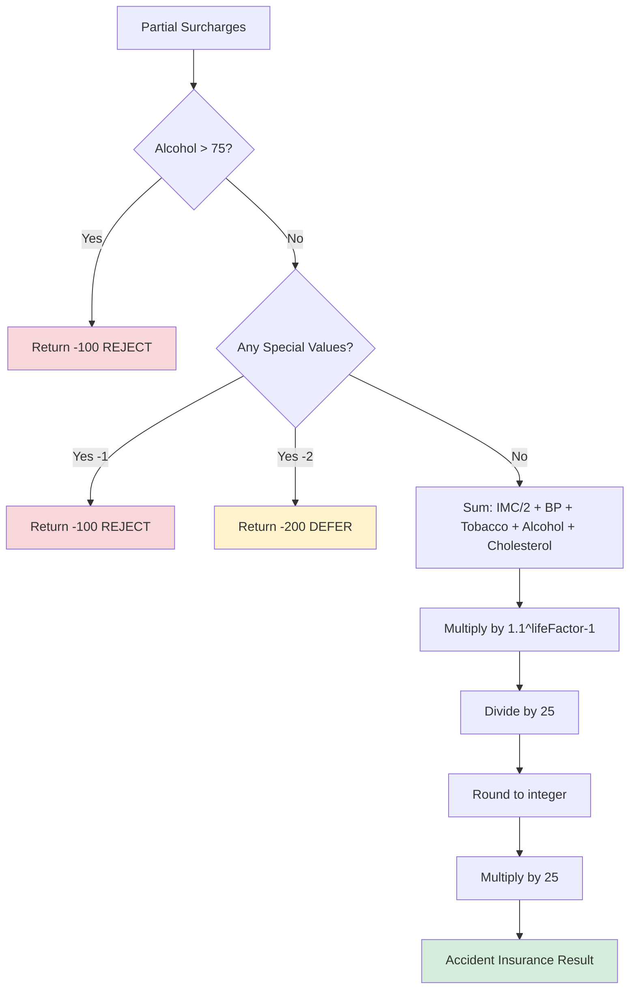
```mermaid
graph TD
    A[Partial Surcharges] --> B{Alcohol > 75?}
    B -->|Yes| C[Return -100 REJECT]
    B -->|No| D{Any Special Values?}
    
    D -->|Yes -1| E[Return -100 REJECT]
    D -->|Yes -2| F[Return -200 DEFER]
    D -->|No| G[Sum: IMC/2 + BP + Tobacco + Alcohol + Cholesterol]
    
    G --> H[Multiply by 1.1^lifeFactor-1]
    H --> I[Divide by 25]
    I --> J[Round to integer]
    J --> K[Multiply by 25]
    K --> L[Accident Insurance Result]
    
    style C fill:#f8d7da
    style E fill:#f8d7da
    style F fill:#fff3cd
    style L fill:#d4edda
```

### Serious Illness Insurance
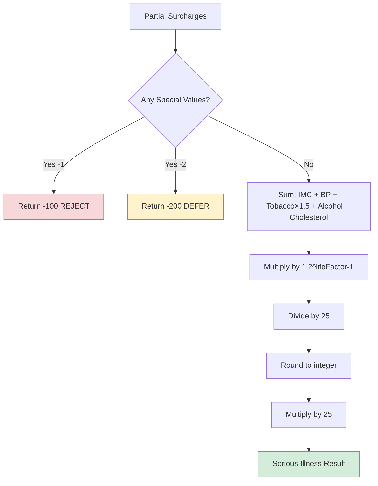
```mermaid
graph TD
    A[Partial Surcharges] --> B{Any Special Values?}
    B -->|Yes -1| C[Return -100 REJECT]
    B -->|Yes -2| D[Return -200 DEFER]
    B -->|No| E[Sum: IMC + BP + Tobacco×1.5 + Alcohol + Cholesterol]
    
    E --> F[Multiply by 1.2^lifeFactor-1]
    F --> G[Divide by 25]
    G --> H[Round to integer]
    H --> I[Multiply by 25]
    I --> J[Serious Illness Result]
    
    style C fill:#f8d7da
    style D fill:#fff3cd
    style J fill:#d4edda
```

### ILT Insurance
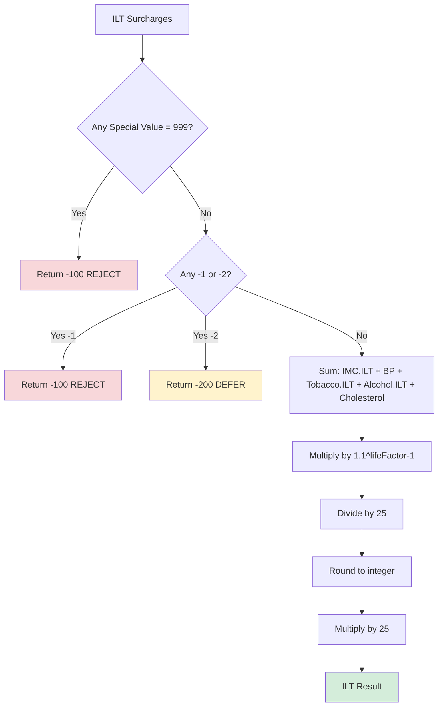
```mermaid
graph TD
    A[ILT Surcharges] --> B{Any Special Value = 999?}
    B -->|Yes| C[Return -100 REJECT]
    B -->|No| D{Any -1 or -2?}
    
    D -->|Yes -1| E[Return -100 REJECT]
    D -->|Yes -2| F[Return -200 DEFER]
    D -->|No| G[Sum: IMC.ILT + BP + Tobacco.ILT + Alcohol.ILT + Cholesterol]
    
    G --> H[Multiply by 1.1^lifeFactor-1]
    H --> I[Divide by 25]
    I --> J[Round to integer]
    J --> K[Multiply by 25]
    K --> L[ILT Result]
    
    style C fill:#f8d7da
    style E fill:#f8d7da
    style F fill:#fff3cd
    style L fill:#d4edda
```

---

## ⚖️ BMI Lookup Logic

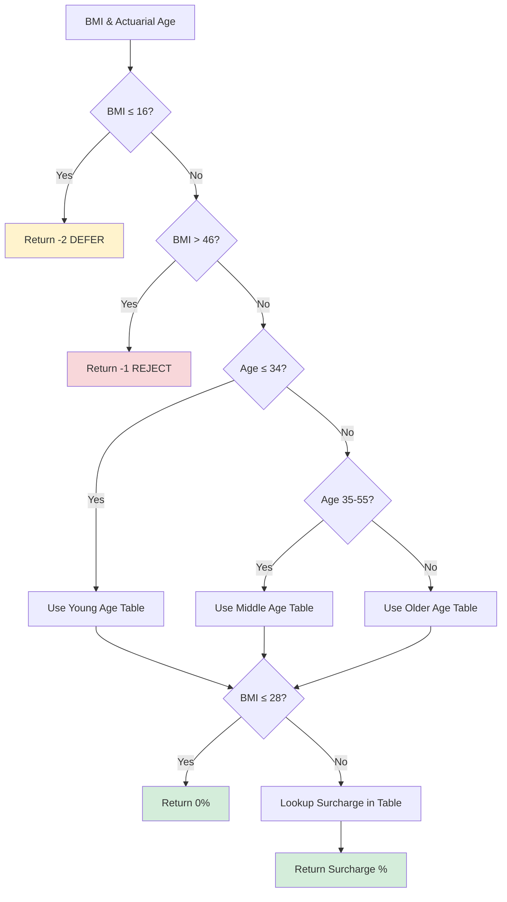
```mermaid
graph TD
    A[BMI & Actuarial Age] --> B{BMI ≤ 16?}
    B -->|Yes| C[Return -2 DEFER]
    B -->|No| D{BMI > 46?}
    
    D -->|Yes| E[Return -1 REJECT]
    D -->|No| F{Age ≤ 34?}
    
    F -->|Yes| G[Use Young Age Table]
    F -->|No| H{Age 35-55?}
    
    H -->|Yes| I[Use Middle Age Table]
    H -->|No| J[Use Older Age Table]
    
    G --> K{BMI ≤ 28?}
    I --> K
    J --> K
    
    K -->|Yes| L[Return 0%]
    K -->|No| M[Lookup Surcharge in Table]
    
    M --> N[Return Surcharge %]
    
    style C fill:#fff3cd
    style E fill:#f8d7da
    style L fill:#d4edda
    style N fill:#d4edda
```

---

## 💓 Blood Pressure Matrix Lookup

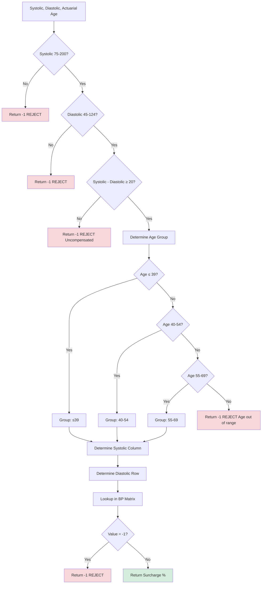
```mermaid
graph TD
    A[Systolic, Diastolic, Actuarial Age] --> B{Systolic 75-200?}
    B -->|No| C[Return -1 REJECT]
    B -->|Yes| D{Diastolic 45-124?}
    
    D -->|No| E[Return -1 REJECT]
    D -->|Yes| F{Systolic - Diastolic ≥ 20?}
    
    F -->|No| G[Return -1 REJECT Uncompensated]
    F -->|Yes| H[Determine Age Group]
    
    H --> I{Age ≤ 39?}
    I -->|Yes| J[Group: ≤39]
    I -->|No| K{Age 40-54?}
    
    K -->|Yes| L[Group: 40-54]
    K -->|No| M{Age 55-69?}
    
    M -->|Yes| N[Group: 55-69]
    M -->|No| O[Return -1 REJECT Age out of range]
    
    J --> P[Determine Systolic Column]
    L --> P
    N --> P
    
    P --> Q[Determine Diastolic Row]
    Q --> R[Lookup in BP Matrix]
    R --> S{Value = -1?}
    
    S -->|Yes| T[Return -1 REJECT]
    S -->|No| U[Return Surcharge %]
    
    style C fill:#f8d7da
    style E fill:#f8d7da
    style G fill:#f8d7da
    style O fill:#f8d7da
    style T fill:#f8d7da
    style U fill:#d4edda
```

---

## ⚠️ Special Value Handling

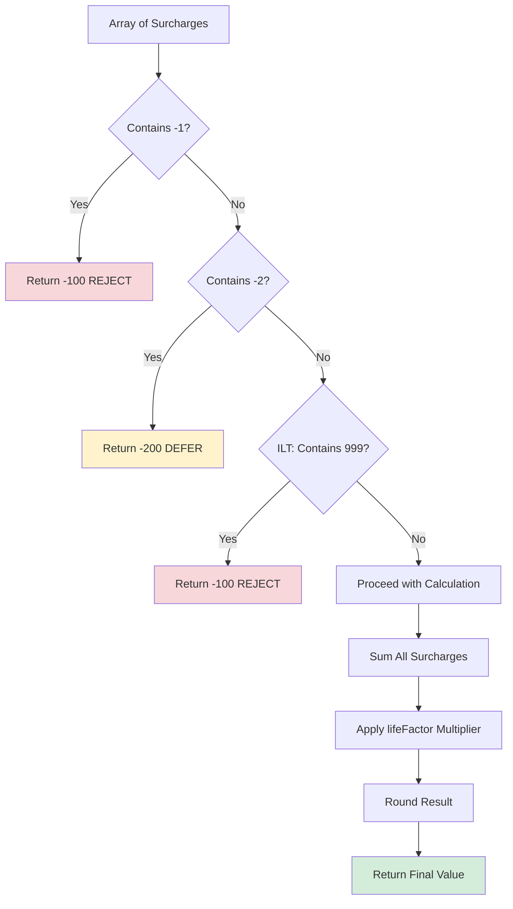
```mermaid
graph TD
    A[Array of Surcharges] --> B{Contains -1?}
    B -->|Yes| C[Return -100 REJECT]
    B -->|No| D{Contains -2?}
    
    D -->|Yes| E[Return -200 DEFER]
    D -->|No| F{ILT: Contains 999?}
    
    F -->|Yes| G[Return -100 REJECT]
    F -->|No| H[Proceed with Calculation]
    
    H --> I[Sum All Surcharges]
    I --> J[Apply lifeFactor Multiplier]
    J --> K[Round Result]
    K --> L[Return Final Value]
    
    style C fill:#f8d7da
    style E fill:#fff3cd
    style G fill:#f8d7da
    style L fill:#d4edda
```

---

## 🏗️ Service Architecture

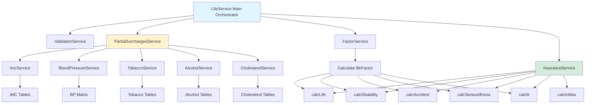
```mermaid
graph TD
    A[LifeService Main Orchestrator] --> B[ValidationService]
    A --> C[PartialSurchargesService]
    A --> D[FactorService]
    A --> E[InsuranceService]
    
    C --> F[ImcService]
    C --> G[BloodPressureService]
    C --> H[TobaccoService]
    C --> I[AlcoholService]
    C --> J[CholesterolService]
    
    D --> K[Calculate lifeFactor]
    
    E --> L[calcLife]
    E --> M[calcDisability]
    E --> N[calcAccident]
    E --> O[calcSeriousIllness]
    E --> P[calcIlt]
    E --> Q[calcInMax]
    
    K --> L
    K --> M
    K --> N
    K --> O
    K --> P
    
    F --> R[IMC Tables]
    G --> S[BP Matrix]
    H --> T[Tobacco Tables]
    I --> U[Alcohol Tables]
    J --> V[Cholesterol Tables]
    
    style A fill:#e1f5ff
    style C fill:#fff3cd
    style E fill:#d4edda
```

---

## 🔍 Decision Tree: When to Reject

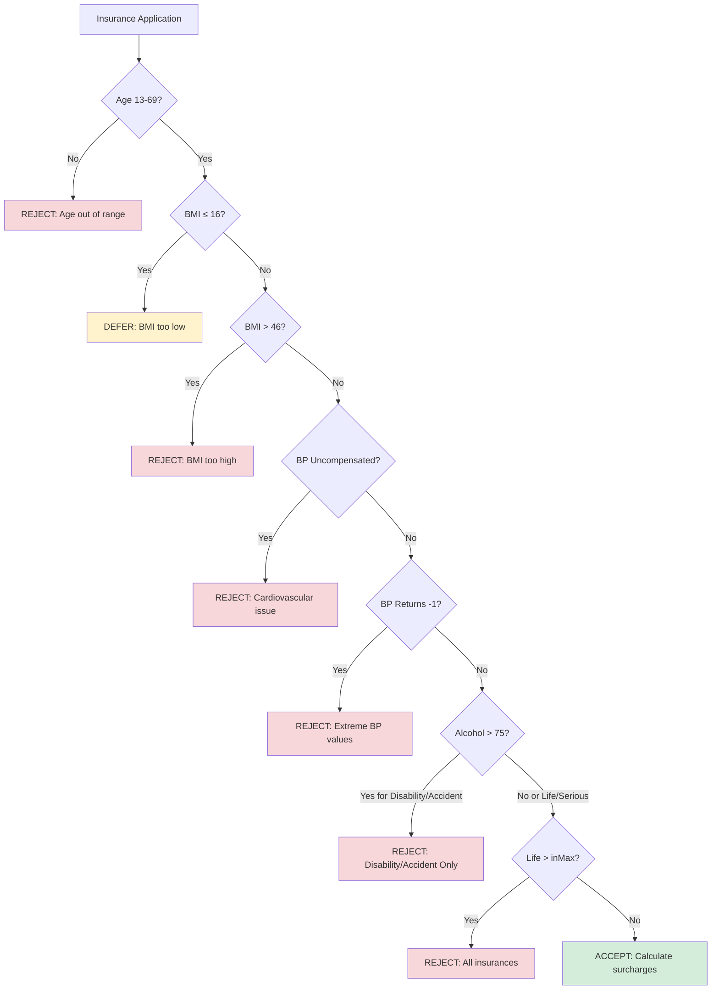
```mermaid
graph TD
    A[Insurance Application] --> B{Age 13-69?}
    B -->|No| C[REJECT: Age out of range]
    B -->|Yes| D{BMI ≤ 16?}
    
    D -->|Yes| E[DEFER: BMI too low]
    D -->|No| F{BMI > 46?}
    
    F -->|Yes| G[REJECT: BMI too high]
    F -->|No| H{BP Uncompensated?}
    
    H -->|Yes| I[REJECT: Cardiovascular issue]
    H -->|No| J{BP Returns -1?}
    
    J -->|Yes| K[REJECT: Extreme BP values]
    J -->|No| L{Alcohol > 75?}
    
    L -->|Yes for Disability/Accident| M[REJECT: Disability/Accident Only]
    L -->|No or Life/Serious| N{Life > inMax?}
    
    N -->|Yes| O[REJECT: All insurances]
    N -->|No| P[ACCEPT: Calculate surcharges]
    
    style C fill:#f8d7da
    style E fill:#fff3cd
    style G fill:#f8d7da
    style I fill:#f8d7da
    style K fill:#f8d7da
    style M fill:#f8d7da
    style O fill:#f8d7da
    style P fill:#d4edda
```

---

## 🎯 inMax Threshold Logic

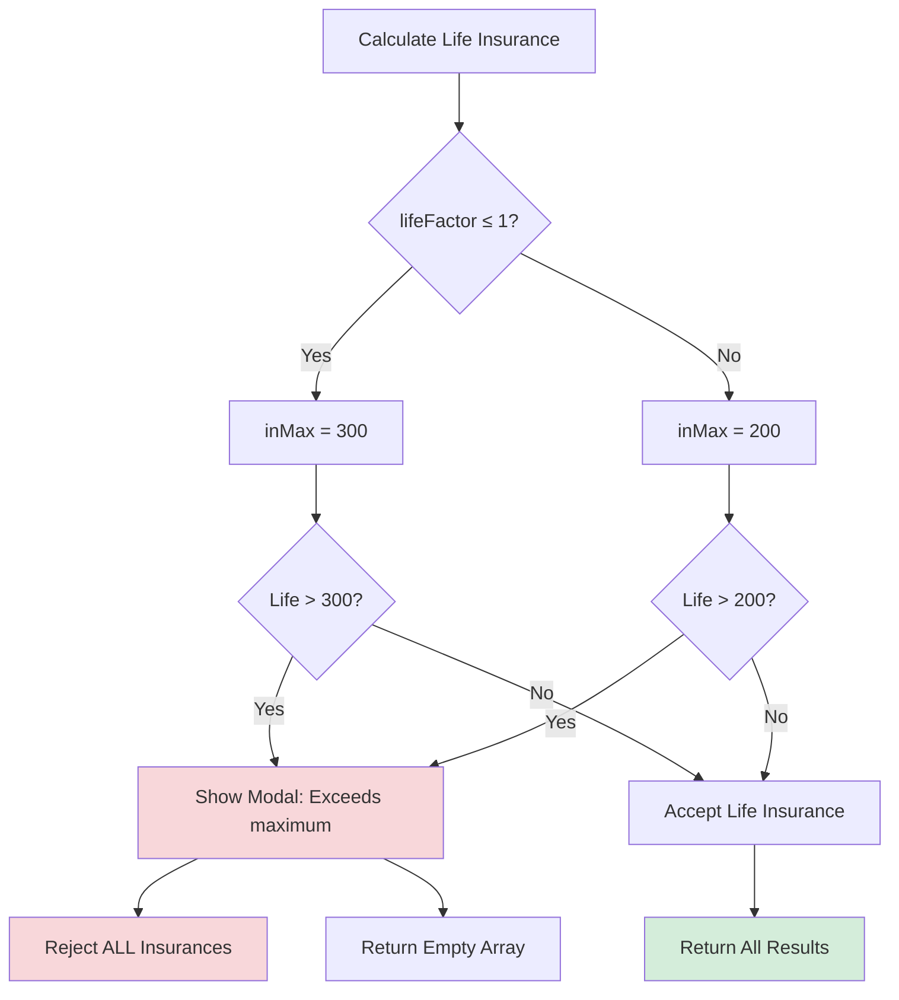
```mermaid
graph TD
    A[Calculate Life Insurance] --> B{lifeFactor ≤ 1?}
    B -->|Yes| C[inMax = 300]
    B -->|No| D[inMax = 200]
    
    C --> E{Life > 300?}
    D --> F{Life > 200?}
    
    E -->|Yes| G[Show Modal: Exceeds maximum]
    E -->|No| H[Accept Life Insurance]
    
    F -->|Yes| G
    F -->|No| H
    
    G --> I[Reject ALL Insurances]
    G --> J[Return Empty Array]
    
    H --> K[Return All Results]
    
    style G fill:#f8d7da
    style I fill:#f8d7da
    style K fill:#d4edda
```

---

## 🔄 Complete Calculation Sequence

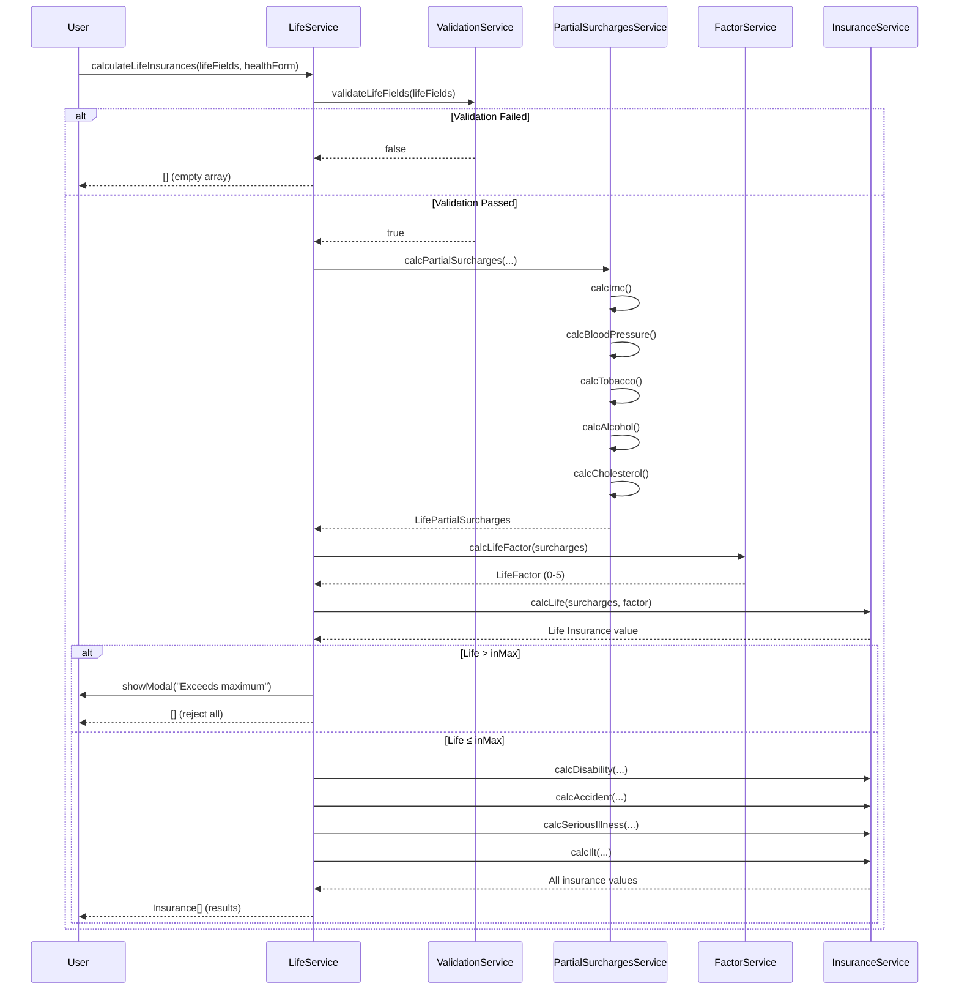
```mermaid
sequenceDiagram
    participant User
    participant LifeService
    participant ValidationService
    participant PartialSurchargesService
    participant FactorService
    participant InsuranceService
    
    User->>LifeService: calculateLifeInsurances(lifeFields, healthForm)
    LifeService->>ValidationService: validateLifeFields(lifeFields)
    
    alt Validation Failed
        ValidationService-->>LifeService: false
        LifeService-->>User: [] (empty array)
    else Validation Passed
        ValidationService-->>LifeService: true
        LifeService->>PartialSurchargesService: calcPartialSurcharges(...)
        
        PartialSurchargesService->>PartialSurchargesService: calcImc()
        PartialSurchargesService->>PartialSurchargesService: calcBloodPressure()
        PartialSurchargesService->>PartialSurchargesService: calcTobacco()
        PartialSurchargesService->>PartialSurchargesService: calcAlcohol()
        PartialSurchargesService->>PartialSurchargesService: calcCholesterol()
        
        PartialSurchargesService-->>LifeService: LifePartialSurcharges
        
        LifeService->>FactorService: calcLifeFactor(surcharges)
        FactorService-->>LifeService: LifeFactor (0-5)
        
        LifeService->>InsuranceService: calcLife(surcharges, factor)
        InsuranceService-->>LifeService: Life Insurance value
        
        alt Life > inMax
            LifeService->>User: showModal("Exceeds maximum")
            LifeService-->>User: [] (reject all)
        else Life ≤ inMax
            LifeService->>InsuranceService: calcDisability(...)
            LifeService->>InsuranceService: calcAccident(...)
            LifeService->>InsuranceService: calcSeriousIllness(...)
            LifeService->>InsuranceService: calcIlt(...)
            
            InsuranceService-->>LifeService: All insurance values
            LifeService-->>User: Insurance[] (results)
        end
    end
```

---

## 📐 BMI Calculation Flow

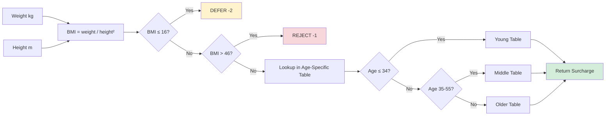
```mermaid
graph LR
    A[Weight kg] --> C[BMI = weight / height²]
    B[Height m] --> C
    
    C --> D{BMI ≤ 16?}
    D -->|Yes| E[DEFER -2]
    D -->|No| F{BMI > 46?}
    
    F -->|Yes| G[REJECT -1]
    F -->|No| H[Lookup in Age-Specific Table]
    
    H --> I{Age ≤ 34?}
    I -->|Yes| J[Young Table]
    I -->|No| K{Age 35-55?}
    
    K -->|Yes| L[Middle Table]
    K -->|No| M[Older Table]
    
    J --> N[Return Surcharge]
    L --> N
    M --> N
    
    style E fill:#fff3cd
    style G fill:#f8d7da
    style N fill:#d4edda
```

---

## 🚬 Tobacco Calculation Flow

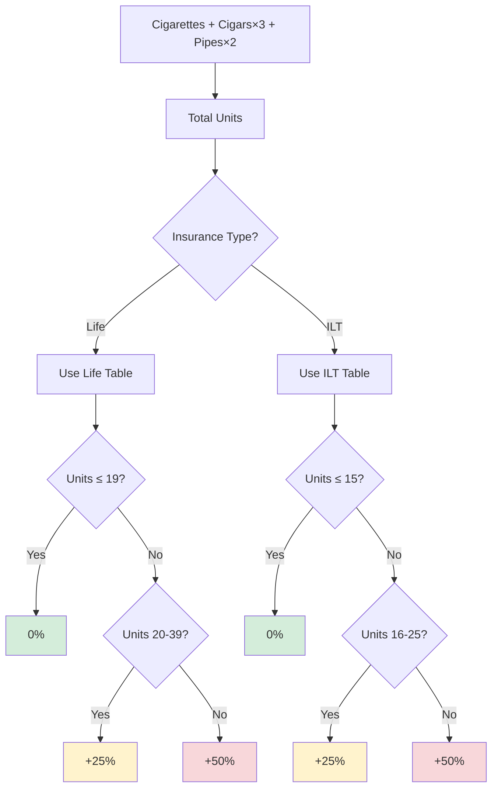
```mermaid
graph TD
    A[Cigarettes + Cigars×3 + Pipes×2] --> B[Total Units]
    B --> C{Insurance Type?}
    
    C -->|Life| D[Use Life Table]
    C -->|ILT| E[Use ILT Table]
    
    D --> F{Units ≤ 19?}
    F -->|Yes| G[0%]
    F -->|No| H{Units 20-39?}
    
    H -->|Yes| I[+25%]
    H -->|No| J[+50%]
    
    E --> K{Units ≤ 15?}
    K -->|Yes| L[0%]
    K -->|No| M{Units 16-25?}
    
    M -->|Yes| N[+25%]
    M -->|No| O[+50%]
    
    style G fill:#d4edda
    style I fill:#fff3cd
    style J fill:#f8d7da
    style L fill:#d4edda
    style N fill:#fff3cd
    style O fill:#f8d7da
```

---

## 🍷 Alcohol Age Discount Flow

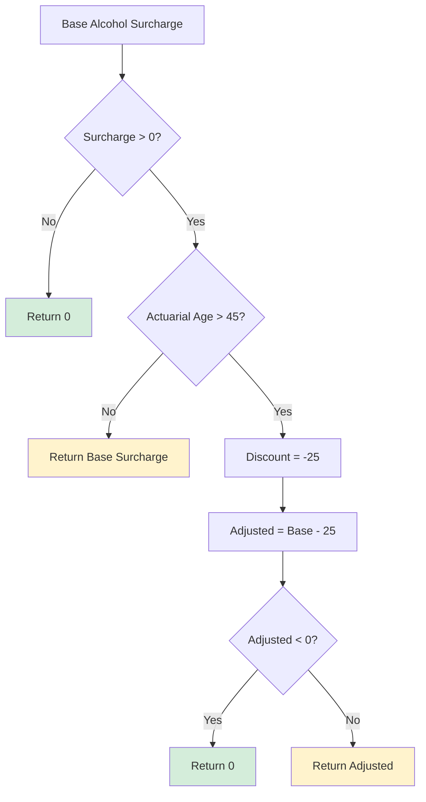
```mermaid
graph TD
    A[Base Alcohol Surcharge] --> B{Surcharge > 0?}
    B -->|No| C[Return 0]
    B -->|Yes| D{Actuarial Age > 45?}
    
    D -->|No| E[Return Base Surcharge]
    D -->|Yes| F[Discount = -25]
    
    F --> G[Adjusted = Base - 25]
    G --> H{Adjusted < 0?}
    
    H -->|Yes| I[Return 0]
    H -->|No| J[Return Adjusted]
    
    style C fill:#d4edda
    style E fill:#fff3cd
    style I fill:#d4edda
    style J fill:#fff3cd
```

---

## 📚 Related Documentation

- **Quick Reference**: Fast formula lookup
- **Common Mistakes**: Top errors to avoid
- **Edge Cases**: Boundary conditions
- **WHY Guide**: Actuarial rationale

---

**Last Updated**: May 11, 2026  
**Maintained By**: Development Team  
**Diagrams**: Mermaid.js interactive flowcharts
